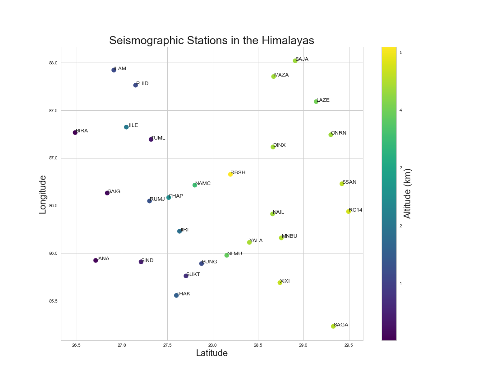

# Plotly: A Better Approach to Python Data Visualization

This repo contains work on a blog post about different approaches to data visualization, comparing 2D static plots, 3D static plots, and 2D interactive plots in Plotly. The notebook ```interactive_scatter.ipynb``` contains a finalized version.



## Dataset 

The dataset in ```data/stations.txt``` contains elevation, latitude, and longitude data on seismographic stations in the Himalayas. 
